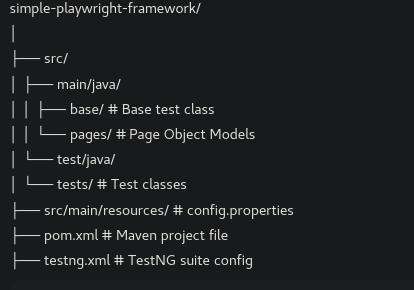

# 🚀 Playwright Java Automation Framework

This is a simple yet scalable **UI test automation framework** built using [Microsoft Playwright](https://playwright.dev/java/) with **Java**, **Maven**, and **TestNG**.

## 📌 Features

- ✅ Page Object Model (POM) architecture
- ✅ Cross-browser testing (Chromium, Firefox, WebKit)
- ✅ Configurable via `config.properties`
- ✅ Organized test structure using TestNG
- ✅ Easy integration with CI tools (Jenkins, GitHub Actions)

---

## 🧾 Prerequisites

- Java 11 or higher
- Maven 3.6+
- VS Code (or any Java IDE)
- Internet connection (for first-time browser download)

---

## 🛠 Project Structure




---

## ⚙️ Setup & Run

### 1. Clone the Repo

```bash
git clone https://github.com/your-username/simple-playwright-framework.git
cd simple-playwright-framework
```

### 2. Install Browsers (Required by Playwright)

```bash
mvn exec:java -e -Dexec.mainClass=com.microsoft.playwright.CLI -Dexec.args="install"
```

### 3. Run All Tests

Execute all the tests in the project using:

```bash
mvn test
```

To code generate a recording of your steps;

```bash
npx playwright codegen https://opensource-demo.orangehrmlive.com
```

### 🔧 Configuration

Update `src/main/resources/config.properties`:

```properties
base.url=https://opensource-demo.orangehrmlive.com
browser=chromium
headless=false
username=Admin
password=admin123
timeout=30
```

### 📊 Types of Testing Supported

| Type                 | Description                                              |
|----------------------|----------------------------------------------------------|
| ✅ Smoke Testing      | Verifies if basic app functionalities work               |
| ✅ Functional Testing | Tests individual features like login, logout, etc.       |
| ✅ Regression Testing | Ensures no features break after changes                  |
| ✅ End-to-End Testing | Simulates user flows across multiple pages               |
| ✅ UI Testing         | Validates element visibility and interactions            |
| ✅ Data-Driven Testing| Runs tests using different input data                    |

### 🧠 Best Practices

- ✅ Keep test data outside test logic
- ✅ Use POM (Page Object Model) to organize page interactions
- ✅ Avoid hard-coded waits — use smart waits
- ✅ Keep tests atomic and idempotent

---

### 📈 Reporting

You can integrate tools like:

- **Allure** – for rich HTML reports
- **Extent Reports**
- **Native TestNG reports**

---

### 🤝 Contributing

1. Fork the repo
2. Create a feature branch (***with your name in it***):

```bash
git checkout -b feature/your-feature
```

3. Commit your changes:

```bash
git commit -m "Add feature"
```
4. Push the branch:

```bash
git push origin feature/your-feature

```

---

### 📖 License

This project is licensed under the **MIT License**.

---

### 🙋‍♀️ Maintainer

**Immaculate Kimani**  
📧 [immaculatekimani2@gmail.com](mailto:immaculatekimani2@gmail.com)
